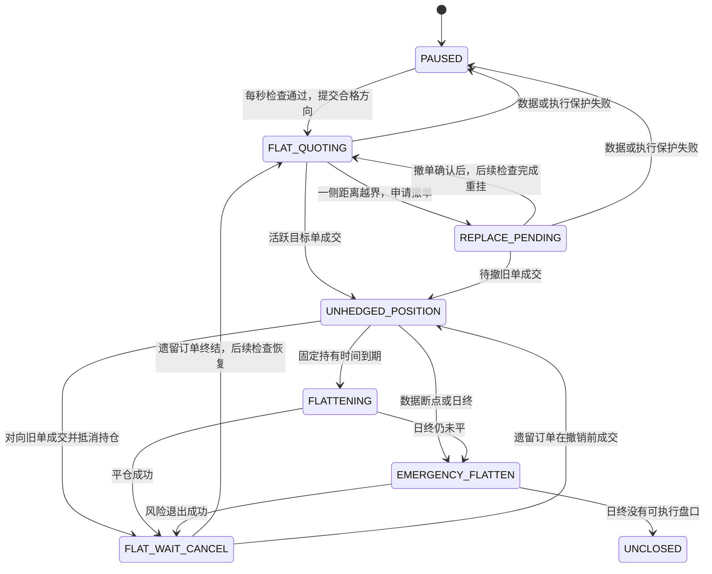

# Mid 距离带回放器实施计划

日期：2026-09-15  
状态：已实施首版；合成测试已通过，尚未运行真实历史回放。  
用户已确认：读取自动选参结果，不对冲，目标合约成交后按固定时间平仓。

## 1. 目标与范围

让 `auto_parameters.csv` 直接驱动现有程序化回放器。每个合约的 BUY、SELL 使用各自的 Min/Target/Max，每秒检查挂单，逐条行情模拟成交，固定持有时间后按可执行盘口平仓，输出可追溯的模拟损益。

沿用 `scripts/run_programmatic_simulation.py` 入口与 `src/programmatic_simulation.py::_DayReplay`。新增明确的 `quote_mode=mid_distance_band` 分支；旧入口默认仍为 `last_price_grid`，保留原 W/D/S 模式。新模式不经过 W/D/S 参数扫描，不需要 fair 或对冲参考合约，不新增回测框架、策略接口层或第三方依赖。

本计划包含参数接入、目标行情适配、报价与订单生命周期、定时退出、报告和必要测试。自动选参算法修正、正常波动分位数生成器、实盘下单、多合约共享资金组合回测和自动滚动选参不在本轮实现范围。

### 1.1 规则的来源

| 类型 | 内容 |
|---|---|
| 用户已经确定 | 先审实施计划；不对冲；固定持有时间后平目标合约 |
| 两份模型文件定义 | BUY/SELL 独立参数；Mid 定价；每秒检查；区间内保留、越界撤换；距离为小数 |
| 本计划拟定的执行细节 | 持有秒数必填；单合约同时一笔目标持仓；整手 Last 触达成交假设；按方向撤换；订单延迟和取整规则 |
| 需要真实回放时提供 | 参数 CSV、行情和日期区间、持有秒数；实际费用及必要元数据覆盖 |

模型文档是设计输入。本文将其业务规则转成可复核的执行约定，不把文档中的命令视为本次实际运行指令。

### 1.2 已核对的源码依据

以下路径相对于仓库根目录；行号为本次检查时的位置。

| 位置 | 当前行为及改造依据 |
|---|---|
| `src/programmatic_simulation.py:195` | 校验强制 W/D/S、至少两个 fair 参考和对冲合约，新模式需分支 |
| `src/programmatic_simulation.py:277` | `build_grid()` 将 W、D 分别向上换算成跳数，生成对称双向报价 |
| `src/programmatic_simulation.py:551` | 主循环逐行推进；当前部分报价保护位于成交判断之前 |
| `src/programmatic_simulation.py:671` | 新单、撤单、ACK 事件与订单日志可以复用 |
| `src/programmatic_simulation.py:747` | `submitted` 也被视为 live；当前能在新单 ACK 到达前成交 |
| `src/programmatic_simulation.py:776` | 当前提交和替换均围绕双向整组订单设计 |
| `src/programmatic_simulation.py:887` | 初始锚点来自 LastPrice；重定锚使用确认时间、W 和 S |
| `src/programmatic_simulation.py:1082` | 已有不对冲的固定时间退出及异常退出 |
| `src/programmatic_simulation.py:1184` | 平多使用买一，平空使用卖一；已有一档数量检查 |
| `src/programmatic_simulation.py:1258` | 已有乘数、手数、手续费和逐笔损益 |
| `src/programmatic_simulation.py:1419` | 默认 Last/VWAP/盘口任一触发；`strict_cross` 不包含等价触达 |
| `src/programmatic_simulation.py:1660` | 事件标签接口要求旧中文事件表，不能直接读取新事件明细 |
| `src/programmatic_simulation.py:1812` | 已有逐笔行情、报价和交易流程详情，但字段绑定 W/D/S、fair |
| `src/mid_analyzer.py:163,226,309` | 已有来源发现、CSV/ZIP 读取和保留原始行的 Mid/Volume 处理 |
| `src/tick_detector/tick_io.py:469,551` | 旧预处理合并同时间戳；成交额异常可能同时作废正成交量增量 |

上轮已直接执行四个现有测试函数，验证不对冲退出、Last 定锚、重定锚及撤单确认前成交；另用构造样例复现了新单 ACK 前成交和数据处理差异。它们是现有行为证据，不是新模式的验收结果。

## 2. 输入与参数契约

### 2.1 自动选参 CSV

必需列：`InstrumentID, Direction, SafeDistance, TargetDistance, MinDistance, MaxDistance, Status`。

| 字段 | 处理规则 |
|---|---|
| `InstrumentID` | 去首尾空格、转大写，按现有合约规则匹配真实月份合约；保留原始值 |
| `Direction` | 仅接受 BUY、SELL，忽略大小写及首尾空格 |
| `Status=OK` | 启用该方向，但仍校验全部距离 |
| `Status=NO_QUALIFIED_DISTANCE` | 禁用该方向；允许 Target/Min/Max 为空；记录原因 |
| 未提供某方向 | 只禁用缺失方向，不能复制另一侧参数或自动生成对称参数 |
| 两侧均禁用 | 合约不回放，汇总明确标为无合格方向 |
| 距离 | 有限小数；`0 <= SafeDistance <= TargetDistance`，`0 < MinDistance <= TargetDistance <= MaxDistance < 1` |
| 重复键 | 合约归一化后 `(合约,方向)` 必须唯一，重复即报错，不选择第一行 |
| 未知状态、非法方向或非法价格比例 | 参数文件整体校验失败，在读取大体量行情之前报错 |

`0.0125` 表示 1.25%。不根据数值大小猜测单位，不把旧 W/D/S 百分比值直接传入新模式。

`SafeDistance` 约束 Target 的合法性，并保留在报告中。首版按 CSV 原值执行 Min/Max，不对 `MinDistance < SafeDistance` 自动截断；报告明确标记这项关系。如果需要“挂单始终不低于 Safe”，应先修订选参模型，而后用修订后的 CSV 再回放。

`EventCount`、`IsolationRate`、`FollowRatioSource`、`ObservedTradingDays` 等附加列作为选参背景保留，不参与在线成交或平仓判断。CSV 不含可靠标定日期时，报告标记标定区间未知，不宣称样本外验证。

### 2.2 运行入口

沿用单配置脚本，新增 `--parameters`。提供它时选择新模式；未提供它时保留现有 `--config` 用法。新模式可以带可选执行配置，但不得混入 W/D/S、对冲或其他相冲突模式字段。

| 新模式入口参数 | 约定 |
|---|---|
| `--parameters` | 自动选参 CSV，必填 |
| `--input` | 目标 Tick 文件、目录或 ZIP，必填；复用 Mid 来源发现能力 |
| `--start-date / --end-date` | 回放交易日区间，必填，YYYYMMDD |
| `--hold-seconds` | 固定持有秒数，必填、有限且大于零；必须可准确换算为整数毫秒 |
| `--output-dir` | 必填；要求新目录或空目录，避免覆盖旧结果 |
| `--config` | 可选的执行假设覆盖；新模式不要求目标合约或参考合约配置 |
| `--contracts` | 可选，逗号分隔的合约子集；必须在参数 CSV 中存在 |

主路径下模型已经决定全部合约和双向距离，无需再填 quote_shapes、latency_profiles 或 W/D/S。

下面是实施后的用法示例；本次只用合成行情验证，没有执行真实历史回放。示例的 2 秒是命令参数，实际持有时间由运行者显式指定。

```bash
./venv/bin/python scripts/run_programmatic_simulation.py \
  --parameters output/auto_result/auto_parameters.csv \
  --input data/tick2026 \
  --start-date 20260401 --end-date 20260430 \
  --hold-seconds 2 \
  --output-dir output/mid_distance_202604
```

### 2.3 简单配置与固定执行约定

首版常用配置沿用：`target_lots=1`、`account_equity=100000`、`max_margin_ratio=0.30`、`default_margin_rate=0.10`、手续费默认 0、新单生效延迟 500ms、撤单确认延迟 500ms、每分钟报撤上限 20、数据断点阈值 3000ms、一档数量必须覆盖平仓手数。报告完整展示实际生效值；默认值是研究假设，不代表某个合约的实际交易条件。

新模式使用 `order_effective_latency_ms` 表达模拟订单到达市场的延迟；不把旧 `new_order_ack_latency_ms` 偷换成新含义。复用 pending 事件处理，但新单日志使用明确的 `active` 时点。旧模式的 ACK 语义保持原状。

固定约定：检查周期 1000ms、不对冲、同一合约最多一笔持仓、每方向至多一张尚未终结的开仓单。新模式不读取 `reanchor_confirm_ms`、`resume_confirm_ms`、`min_reprice_interval_ms` 和 `cooldown_ms`，也不引入对应替代旋钮。退出后等仓位已平及遗留订单终结，在下一次挂单检查时恢复。

最小跳动和乘数优先复用 `COMMODITY_PROFILES`，在运行配置中保存值和来源；支持按合约显式覆盖 `tick_size` 与 `contract_multiplier`，缺失、非有限或非正数直接停止该合约。手续费与保证金率沿用现有按品种覆盖方式。只加载目标行情，不要求日线或参考合约来推导 Mid。

## 3. 目标行情适配与因果顺序

### 3.1 复用原始行处理

新模式的来源链：`discover_sources → read_source → 合约/交易日分组 → prepare_group → 回放字段适配`。

1. 参数和合约过滤先完成；来源列表只发现一次，按合约和日期顺序加载，避免每个合约反复扫描全部 ZIP。
2. 沿用直接 CSV 优先于日 ZIP、日 ZIP 优先于其他 ZIP 的来源选择，记录舍弃来源。源日期和字段 TradingDay 冲突时记录并跳过，不跨日拼接。
3. 保留原始行顺序和来源行号；同时间戳的多行全部保留，不按 Last 极值重新排序，不调用 `_collapse_same_time_key()`。
4. Mid 和增量成交量复用 `prepare_group()`；数据不需要 Turnover/AveragePrice。正成交量增量不受成交额字段影响。
5. `mid → mid_price`；补齐 `contract, commodity, trade_date, tick_size, contract_multiplier, display_time` 和原始行身份。记录中同时保留 `source_file + source_row`。
6. 时钟沿用该模块可跨午夜的 `ts_ms`，适配为回放内部毫秒轴；新模式不重新排序来掩盖时间倒退。非法时间或非跨午夜倒退使该合约日失败并记录原因，取消发布该日不完整损益。
7. `prepare_group()` 默认分段阈值为 300 秒；回放仍保留更严格的 3 秒执行断点保护。保留基础增量，另设回放成交资格标记屏蔽跨执行断点的增量，不宣称两个模块最终有效样本完全相同。
8. 复用现有交易时段与开盘 60 秒保护口径，记录被保护行数。这是额外执行过滤；不得将因此漏掉的机会解释为模型计算错误。后续若换交易时段规则，另记录规则版本。

原始 Mid 有效但 Last 无效时，可以管理报价；该行不能提供 Last 成交证据。已有订单的成交判断也不能仅因当前价差变大而被直接跳过，以免丢掉普通行情造成的亏损。

### 3.2 行情、成交、检查的处理顺序

新模式每条有效行情按以下顺序处理：

1. 推进此前已安排的订单生效/撤单确认事件，保留订单各自的提交、生效、撤销时间。
2. 检查当前增量是否可观察：首条、成交量回退、跨数据断点等不能补造成交。
3. 先对本行到达前已存在且有成交资格的订单判断 Last 触达；持仓期间仍处理未撤完的对向单。
4. 执行持仓计时、风险退出和可执行盘口平仓。
5. 最后，在到达本秒检查时点时，依据当前可见 Mid 处理空仓挂单。新决策产生的订单不能回头使用本行成交证据。

“每秒一次”固定为毫秒时钟的秒格：一条行情首次进入新的秒格时执行一次，初始可交易行情也可执行一次。没有行情的秒不补发动作，不使用后来的行情填补过去。某秒首行已经执行检查后，同秒后续原始行仍能触发旧单成交，但不再重新检查挂单。

同时间戳没有更精确的可观察委托到达顺序。新单即使生效延迟设为 0，也不得使用提交时所在时间戳的其他行成交；等待更晚时间戳。既有活跃单仍逐行处理同时间戳的新增成交。

新单在相邻两行之间才生效时，不把整个区间的成交增量追溯分配给该单：要求订单在前一有效原始行时已生效，才使用这一增量。被排除的区间记录为 `activation_interval_unknown`。撤单按配置确认时点终结；跨确认时点的快照区间内先后关系不能从 Last 完整还原，报告明确披露该快照假设。

## 4. 挂单与撤换

### 4.1 定价及逐方向资格检查

```text
BUY.raw_price  = Mid × (1 − BUY.TargetDistance)
SELL.raw_price = Mid × (1 + SELL.TargetDistance)

BUY.price  = floor(BUY.raw_price / tick_size) × tick_size
SELL.price = ceil(SELL.raw_price / tick_size) × tick_size

BUY.effective_distance  = (Mid − BUY.price) / Mid
SELL.effective_distance = (SELL.price − Mid) / Mid
```

使用浮点容差避免整跳价误取整；距离比较容差固定为 `1e-12`。Mid 不先取整，允许半跳中价。

新单取整后的价格必须为正，并仍处于该方向的 Min/Max 区间；粗 tick 使它越过 Max 时，记录 `rounded_distance_out_of_band` 并跳过该方向，不反向压价来凑区间。

保留现有价差保护含义：该侧实际报价距离必须严格超过 `quote_spread_multiple × spread`，默认倍数为 2；按新价格实际距离计算，不再读取 W_ticks+D_ticks。保证金按允许挂出的方向及单笔目标持仓计算，不再预留对冲腿资金。保护失败时给出该方向具体原因。

### 4.2 检查动作

| 该方向的情况 | 动作 |
|---|---|
| 没有合格参数 | 不挂单 |
| 空仓、没有旧单、定价与风控通过 | 挂 Target 单 |
| 订单待生效 | 等待；不重复提交 |
| 活跃单实际距离落在闭区间 `[Min, Max]` | KEEP，订单 ID 和价格保持不变 |
| 活跃单距离小于 Min 或大于 Max | 只申请撤掉该方向订单 |
| 正等待撤单确认 | 不提交同方向新单 |
| 撤单确认已到达、仍空仓 | 在下一次每秒检查中，使用当时可见 Mid 重新定价并提交 |
| 持仓中 | 不新增开仓单，继续完成旧单撤销与退出 |

撤单请求时不冻结未来重挂价格。确认完成后到下一次检查之间形成可观察的空档；重挂记录其真实定价时点。这是本计划对模型撤单/重挂伪代码的具体化，报告应展示该空档。

BUY 和 SELL 的订单 ID、待撤状态、检查结果独立。全局 `REPLACE_PENDING` 可以继续作为展示状态，但不能因此暂停另一侧正常检查，更不能每次一起撤掉两侧。

如果单笔检查涉及两侧，先计算当次所需报单数量并检查动作预算；预算不足不按遍历顺序偏向 BUY。必需的风险撤单仍发送并计数；新单因动作限制未提交要记录原因，后续检查重试。

## 5. 成交、持仓、退出和记账

### 5.1 首版成交标准

新模式固定标识 `last_trade_touch`：

- 当前原始行的 Last 有效，且可用 `ΔVolume > 0`。
- 买单 `LastPrice <= limit_price`；卖单 `LastPrice >= limit_price`。
- 订单满足第 3 节的生效和因果顺序要求，且尚未撤销终结。
- 首版整手成交，要求区间新增成交量至少达到配置手数；不足记录数量未知，不自动部分成交。
- 模拟成交价格为原委托限价，不用更极端的 Last 给自己增加收益。

该规则只是一种快照触达假设，无法证明限价处的排队轮到本单；区间成交量也不是该价位成交量。VWAP 和盘口穿价不作为此模式开仓证据，普通行情的 Last 触达照样计入。

可沿用已有 `strict_cross` 做明确标记的后续对照，但首版不自动生成多种成交假设的参数网格。未来 FollowRatio、孤立标签、日终统计和事件列表均不参与本行交易决策。

### 5.2 仓位与退出

一侧成交后，立刻申请撤掉其他目标开仓单，进入 `UNHEDGED_POSITION`，保存 `exit_due_key = fill_key + hold_ms`，不读取对冲行情。

常规退出：到期后第一条有效、可交易且一档数量足够的目标盘口，用买一平多、卖一平空。记录计划退出时点、实际退出时点及延迟。不到期不因盈利或亏损提前退出；没有止盈、止损或恢复率平仓规则。

异常退出沿用现有含义：

- 对向单在撤单确认前成交：按其限价抵消目标持仓，记录 `opposite_fill_before_cancel`，属于提前退出。
- 数据断点：恢复后只使用恢复时实际可见盘口尝试风险退出，不伪造断点中的成交价。
- 到期但无可执行盘口：保持 `FLATTENING`，逐行重试，不能用 Mid 或 Last 代替平仓价。
- 日终仍有持仓：在末条可执行报价尝试平仓，否则记录未平；未平记录不进入已实现净损益。
- 已定时平仓但遗留撤单尚未确认：不恢复主动开仓；若遗留订单随后成交，作为带 `late_cancel_fill` 原因的新实际模拟持仓处理，继续定时退出，不能丢弃风险敞口。

每个合约独立运行、同合约 BUY/SELL 共享一笔持仓约束。不同合约的结果是独立资金假设下的损益，首版不合成为共享资金账户收益率，也不自动复利调整手数。

### 5.3 状态流转



`FLAT_WAIT_CANCEL` 是持仓已平但仍有遗留开仓单的等待状态，没有人为冷却倒计时。订单自身状态使用 `submitted → active → cancel_requested → cancelled`，任一有成交资格且未终结订单可转为 `filled`；日终未成交单转为 `expired`。

### 5.4 损益

复用 `_pnl()`、`_commission()`、`_finalize_trade()` 的单目标腿计算：

```text
多头毛损益 = (卖出平仓价 − 买入开仓价) × 乘数 × 手数
空头毛损益 = (卖出开仓价 − 买入平仓价) × 乘数 × 手数
净损益 = 毛损益 − 开平仓手续费
```

新模式汇总仅累加已闭合交易；未平仓数量、已付费用和可观察浮亏单独展示。默认零手续费必须明示；盘口退出不额外加滑点，但价差已通过买一/卖一自然计入。首版输出金额、胜率、最差单笔、最差单日、可观察持仓浮亏、成交数和报撤数，不把最差单笔或最差单日叫作完整权益曲线最大回撤。

## 6. 输出与复盘

复用现有单配置报告，每个合约写入独立子目录，根目录提供一份按合约和方向的 CSV 汇总及轻量 HTML 索引。不增加另一套图表系统。

```text
output_dir/
  replay_summary.csv
  replay_index.html
  parameters_used.csv
  run_config.json
  CONTRACT/
    programmatic_report.html
    programmatic_summary.csv
    programmatic_trades.csv
    quote_state_transitions.csv
    quote_checks.csv
    order_lifecycle.csv
    programmatic_skipped_days.csv
    run_config.json
```

- `parameters_used.csv` 保存原始参数及归一化合约、启停状态和跳过原因，包括被禁用方向。
- `quote_checks.csv` 每次每方向一条，记录来源行号、检查时间、Mid、参数、现有单状态/价格/实际距离、KEEP/CANCEL/SUBMIT/SKIP 及原因。待生效、待撤和参数禁用也有可区分状态。
- 订单生命周期补齐来源行身份、决定/提交/生效/撤销时间、定价 Mid；不得只用同一时间戳的最后一条状态重建秒内全过程。
- 逐笔交易增加成交时参数、定价及成交时 Mid、订单 ID、生效时间、持有毫秒数、计划退出时间、实际退出延迟、成交假设、遗留单竞态原因。
- HTML 显示 Min/Target/Max、实际距离和挂单动作；隐藏不适用的 W/D/S、fair、对冲腿面板。逐笔详情保留成交前 10 秒至退出后 10 秒的原始行和关键订单事件。
- 不提供事件文件时，标签用 `unclassified`，不使用旧的 `normal_move_fill` 冒充已完成归因；新模式不套用旧网格的事件命中率资格判定。
- 根配置保存参数文件 SHA-256、源文件或 ZIP 成员身份、回放区间、生效参数、元数据与费用来源、标定区间已知/未知、成交和时钟规则版本。
- 同区间标定和回放只标记为样本内；没有标定日期证据不推断样本外。首版不强制增加一个上游文件格式来阻塞已有 CSV 接入。
- 所有原始行内容按文本转义进入 HTML，内嵌 JSON 沿用现有安全转义。零成交日、缺失日和无合格方向均有结果说明。

## 7. 文件和函数级改动

| 文件 | 拟改动 |
|---|---|
| `scripts/run_programmatic_simulation.py` | 扩展参数解析；选择新旧模式；新模式一次读取 CSV、过滤合约、顺序执行各合约并写根索引；旧命令不变 |
| `src/programmatic_simulation.py` 配置部分 | 新增 CSV 加载/校验函数；`normalize_programmatic_simulation_config()` 和 `_simulate_programmatic_day_prepared()` 对模式分别校验，直接函数调用不能绕过校验 |
| 同文件数据入口 | 增加目标 Mid 帧适配函数；`run_programmatic_simulation()` 新模式跳过 fair 和 hedge 构建，复用来源发现和原始行处理 |
| 同文件 `_DayReplay` | 新模式的运行顺序和每秒检查；扩展 `_submit_passive()`、`_process_due()`、`_first_target_fill()` 的生效资格；按角色记录待撤/重挂；保留一笔持仓 |
| 同文件报价方法 | 增加 Mid 报价计算与检查小函数；新模式不调用旧 `build_grid()` 或 `_check_reanchor()`；价差和保证金按启用方向计算 |
| 同文件退出/统计 | 复用目标腿定时退出；读取显式 hold_ms；处理平仓后的遗留单；新模式已实现损益分母及方向汇总准确 |
| 同文件详情/输出 | 新字段、检查 CSV、Mid 报告分支；`build_trade_contexts()` 等公共调用方可无 fair/hedge，旧图表内容保持兼容 |
| 新增 `tests/test_mid_distance_replay.py` | 集中 CSV、行情适配、状态机数值样例和端到端测试，优先参数化，不新建测试框架 |
| `tests/test_programmatic_simulation.py`、`tests/test_programmatic_grid.py` | 执行现有回归；仅在公共接口确需兼容断言时小幅补充 |
| `docs/programmatic_grid_replay_guide.md` | 增补新模式入口、费用/成交口径和输出说明 |

优先直接导入 `src.mid_analyzer` 的既有工具，不修改其分析行为。旧 `src/tick_detector/tick_io.py` 的合并和增量计算不全局改变。新模式不接入 `src/programmatic_grid.py` 的扫描和筛选；其公共依赖纳入回归。若实现中发现共享函数需要调整，先检查已列出的所有调用方，并保留旧模式结果。

原工作区已有多处未提交改动。实施前保存相关文件 diff 基线，基于当前工作区追加，不恢复文件、不覆盖用户修改、不自动提交。

## 8. 可运行验收样例

除特别说明，使用虚构 `DEMO` 合约：tick=1、乘数=10、手数=1、手续费每手每边 2；关闭开盘保护对样例时刻的影响，资金及动作预算充足。表格是验收覆盖清单；本次已用合成测试覆盖参数、时序、定价、固定退出、损益和批量输出主路径，真实数据边界仍需单独验证。

基础参数：BUY Safe=0.00816、Min=0.00875、Target=0.0125、Max=0.01625；SELL Safe=0.0103、Min=0.0105、Target=0.015、Max=0.0195。

| 编号 | 输入/触发 | 必须得到的结果 |
|---|---|---|
| A01 参数与单位 | Mid=10000，输入上述小数 | BUY=9875，SELL=10150；不再乘除 100 |
| A02 独立方向 | BUY=OK、SELL=NO_QUALIFIED_DISTANCE | 只有 BUY 单；不存在卖方提交或伪造的 SELL 参数 |
| A03 参数失败 | 重复归一化键、未知方向、NaN/Inf、Target<Safe、Min>Max | 启动前明确失败；不开始回放 |
| A04 区间内保留 | 已挂9875/10150，下一检查 Mid=10000 | 两侧订单 ID 不变，新增报撤次数为0 |
| A05 BUY 太远 | 独立样例中已挂9875/10150，Mid=10040 | BUY距离165/10040约1.6434%越过Max；SELL距离110/10040约1.0956%仍在区间，只撤BUY；确认后Mid仍10040时新买价9914 |
| A06 BUY 太近 | 独立样例中已挂9875/10150，Mid=9960 | BUY距离85/9960约0.8534%低于Min，只撤BUY；SELL保持 |
| A07 边界与取整 | 人工构造实际距离等于Min/Max；另给粗tick使新价距离大于Max | 等于边界KEEP；取整越界跳过并给出原因 |
| A08 每秒检查 | 同一秒提供多行正常Mid变化 | 检查最多一次；原活跃单仍可在该秒后续异常行成交；不使用该秒最后一行提前定价 |
| A09 生效时间 | 0ms提交，延迟2000ms；500ms Last触达 | 无成交；2000ms生效后，从满足前一观察行已生效的后续增量开始可成交 |
| A10 禁止追溯 | 异常行同时触发初次挂单，生效延迟0；后面仍有相同时间戳行 | 新单不能成交于本时间戳；预先活跃的旧单可逐行成交 |
| A11 撤单竞态 | 2000ms请求撤BUY，确认2500ms；2250ms旧BUY触达 | 旧BUY成交，取消重挂意图；2500ms迟到撤单确认不能覆盖filled状态 |
| A12 保留异常行 | 同时间戳的Last依次为10000、9875、10000，中间行有新增成交且旧BUY已生效 | 中间触达不被合并删除；成交定位到正确来源行 |
| A13 独立成交量 | Volume增加1，Turnover为零/回退或字段不存在 | 满足其他条件时Last通道仍可触发；首条、Volume回退或跨执行断点不触发 |
| A14 到期与收益 | 10000ms以9875买入，持有2s；12000ms盘口买一10010 | 12000ms平仓；毛损益1350、手续费4、净损益1346，无对冲订单 |
| A15 空头与亏损 | SELL10150后买回10010；另一独立样例BUY9875后卖出9800 | 前者净1396，后者净-754；亏损不能被事后孤立标签或价差保护删除 |
| A16 无可执行退出 | 到期卖一/买一无效或数量不足，稍后才恢复；另一路日终仍无有效价 | 恢复时退出并记录延迟；日终未平单独统计，不用Mid/Last填造收益 |
| A17 剩余订单 | 定时平仓后尚有对向单待撤，随后该单先于确认成交 | 形成明确的late_cancel_fill持仓并管理退出；不丢单、不重复平原持仓 |
| A18 保护和恢复 | 暂停、价差保护、资金不足、动作预算不足 | 原因清晰；有效区间内旧单成交先于新报价过滤；遗留单未终结不重复开仓 |
| A19 Safe关系 | Safe=0.0096、Min=0.007、Target=0.01；实际距离0.008 | 按原CSV保留，报告标记Min低于Safe；不暗中改为0.0096 |
| A20 时钟与数据源 | 日/月份ZIP含多个合约日、重复来源、跨午夜、时间倒退 | 只取目标日期；确定性去重；午夜时长正确；非法倒退日显式失败 |
| A21 报告一致性 | 包含盈利、亏损、未平、零成交日和一侧禁用 | 按方向和日期加总闭合损益一致；逐笔ID能定位原行；无事件输入标unclassified；无W/D/S必填依赖 |
| A22 兼容旧模式 | 不带--parameters的旧配置及现有grid测试 | W/D/S校验、报价、对冲、报告等现有预期保持通过 |

测试组织为同一个文件中的数个主题：参数契约、订单时序、数值损益、数据适配、命令端到端。表格是行为覆盖要求，不要求每个编号各建一个类或完整 fixture 套件。

## 9. 实施顺序与交付门槛

### 阶段一：参数和目标数据入口

实现第2、3节的加载/校验/字段适配；直接函数和CLI一致；不依赖fair/hedge/Turnover。以A01–A03、A12–A13、A20及临时CSV/ZIP完成入口验证。

### 阶段二：Mid挂单和订单时序

实现按秒、按方向的检查，明确订单生效和撤换时点，补上旧模式未提供的生效资格。用A04–A11、A18–A19验证；同一价格路径改变未来行情，不得改变前面已有订单日志。

### 阶段三：退出和损益

接入显式持有时长，复用不对冲退出与记账，补齐遗留单及未平记录。A14–A17必须验证精确时间、价格和费用，不只断言“存在一笔交易”。

### 阶段四：批量入口和报告

按合约顺序回放并写根索引，补充检查日志、双向参数及逐笔详情。A21完成真实CLI→文件→读回验证；打开一个合成回放HTML，人工/浏览器核对报价原因、原始行和净损益可对应。

### 阶段五：回归与选定历史样本验证

代码测试命令：

```bash
./venv/bin/python -m pytest tests/test_mid_distance_replay.py tests/test_mid_analyzer.py tests/test_programmatic_simulation.py tests/test_programmatic_grid.py -q
```

本次已执行上述相关回归：53 项通过；随后执行 `./venv/bin/python -m pytest tests/ -q`，结果为 246 项通过、1 项跳过。未执行真实历史回放。

若修改公共排序/详情路径，补跑相关现有性能测试，确认没有引入每条行情重复扫描历史订单等退化。测试通过后，按用户选定的一个合约、小日期区间、参数CSV和持有时长运行真实历史回放；至少手工核对首笔、亏损笔、撤单竞态笔及异常退出笔中实际存在的类别。

最终交付包括：生效配置与参数快照、模拟逐笔和每日/方向汇总、可打开报告、相关测试结果、真实数据覆盖范围和无法验证的类别。没有真实成交回报时，结论止于“所列快照成交假设下的模拟收益”。

## 10. 审查时需要注意的模型边界

1. 本计划按输入CSV复现策略。孤立率分母差异、终点FollowRatio、观察交易日估计和空候选异常属于上游问题，未在回放器中隐式修正。
2. 现有代码范围内尚未找到 `volatility_quantiles.csv` 的生成主链路。接入验收可以使用格式合格的现成CSV；完整自动生产流程还需另行确认该输入的来源。
3. 资金、盘口排队、准确成交时间和费用都有模型假设。首版用明确可复现的简单约定，报告保存执行过滤和未知区间计数，避免把机会数量与成交数量直接等同。
4. 本次实现覆盖代码和合成测试；真实历史范围及持有秒数仍应在运行时显式给定。
